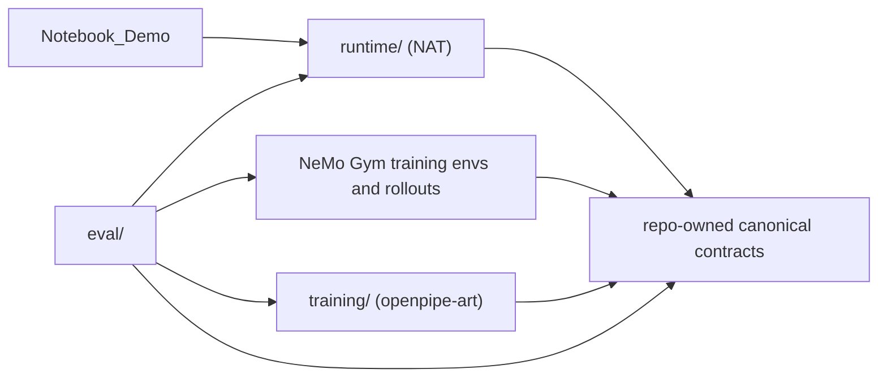

# Migration Plan

## Current Status
- **Phase 1** is **complete**.
- **Phase 2** is **complete**.
- **Phase 3** is **complete**.
- **Phase 4** is **complete**.
- **Phase 5** is **complete**.
- **Phase 6** is **complete**.
- **Phase 7** is **complete**.
- **Phase 8** is **complete**.
- **Phase 9** is **planned**.

The core refactor is complete. The remaining work is to refactor the active repo surfaces so they use the NAT / NeMo Gym / `openpipe-art` ownership model directly, not just describe it in docs.

## Goal
Reshape the repository from a flat, notebook-led demo into a small library with clear ownership boundaries while preserving the current scenario, deterministic tools, and end-to-end workshop flow described in [CLAUDE.md](CLAUDE.md). The active target stack is NAT for interactive runtime orchestration, NeMo Gym for training-time environment and rollout execution, repo-owned canonical contracts and traces, and `openpipe-art` for training-oriented exports and post-training discussion.

## Current Pressure Points
- [src/agent_loop.py](src/agent_loop.py) currently mixes model I/O, prompt policy, validation, fallback repair, trace capture, and trajectory shaping.
- [src/evaluation.py](src/evaluation.py) and [src/training_export.py](src/training_export.py) both encode sequence and reward semantics, so training and offline evaluation are not clearly separated.
- [src/training_export.py](src/training_export.py) is the main catch-all module: it mixes historical rollout-style reward framing, earlier trainer-export assumptions, and scale-out-systems-oriented config sketches that no longer match the active environment.
- [notebooks/late_order_recovery_workshop.ipynb](notebooks/late_order_recovery_workshop.ipynb) is already a consumer of `src/`, but it still contains scripted demo traces and loop-like teaching code that should not remain the architecture source of truth.

## Target Architecture

## Ownership Guardrails
- `runtime/` owns interactive single-episode agent behavior, prompt policy, tool invocation, directory-backed skill discovery, metadata search, detailed skill loading, skill-command execution, and structured event emission. It must not schedule training rollout jobs, construct RL datasets, choose distributed training topology, or own checkpoint conversion logic.
- `envs/` owns task state, validity, transitions, terminal conditions, and reward-relevant facts. It defines what happened, should be structured to back NeMo Gym environment and verification surfaces cleanly, and must not decide trainer behavior or distributed execution settings.
- `rollouts/` owns canonical trace types, trace capture, failure and retry representation, stable serialization, and adapters between repo contracts and NeMo Gym rollout collection. It must not redefine tool schemas, task environment logic, or reward semantics, and it should not become a competing custom rollout framework.
- `training/` owns `openpipe-art`-facing datasets, reward views, experiments, curriculum staging, and training-oriented exports. It must not redefine runtime interfaces or rollout orchestration.
- `eval/` owns offline metrics, reports, and regression summaries. It should consume canonical traces, NeMo Gym environment facts, `openpipe-art` training artifacts, and NAT traces or visualizations rather than re-implementing task transitions or reward shaping.

## Implementation Phases
### 1. Establish canonical contracts first (complete)
- Established the package split under `src/` and made canonical episode and event types in [src/rollouts/trace_types.py](src/rollouts/trace_types.py) the shared contract across the repo.
- Split runtime-facing schemas from environment-specific validation and kept [src/scenario_data.py](src/scenario_data.py) as the deterministic scenario source of truth.

### 2. Refactor runtime into a NAT-friendly single-episode layer (complete)
- Moved deterministic tools and agent behavior into [src/runtime](src/runtime), including prompt policy, tracing, and explicit fallback handling.
- Replaced the flat skills module with directory-backed runtime skills and the canonical NAT-facing interfaces: `list_skills`, `search_skills`, `get_skill`, and `run_skill_command`.

### 3. Make the environment explicit (complete)
- Added explicit environment state, transitions, validators, and reward inputs under [src/envs](src/envs) for the late-order-recovery scenario.
- Moved sequence-sensitive task semantics and reward-relevant facts into the environment so it became the single authority on validity and progress.

### 4. Build the rollout layer around canonical traces (complete)
- Added canonical rollout capture and serialization under [src/rollouts](src/rollouts) and moved episode-recording concerns out of the old catch-all modules.
- Preserved exact turn order and recovery events in the trace format, while framing repo rollout code as adapter and serialization glue around future NeMo Gym-owned training collection.

### 5. Build training semantics layer (complete)
- Split the old training export path into focused modules in [src/training](src/training) for datasets, reward views, experiments, and curriculum.
- Reframed the training layer around an `openpipe-art`-first handoff and staged progression for SFT, RL, and robustness work.

### 6. Remove or quarantine outdated systems assumptions (complete)
- Removed the unused `src/systems` layer and deleted legacy scale-out configuration sketches and references from active code and notebook paths.
- Kept remaining historical systems context as documentation only, with no active training path depending on it.

### 7. Rebuild offline evaluation on top of the new contracts (complete)
- Rebuilt offline evaluation in [src/eval](src/eval) on top of canonical `Episode` traces and environment-owned sequence semantics.
- Kept evaluation repo-owned and human-facing, while preserving the workshop dimensions and avoiding duplication of training reward logic.

### 8. Demote the notebook and finish the public surfaces (complete)
- Demoted the notebook to a consumer of canonical `src.*` modules and moved scripted traces and legacy adapters out of notebook cells.
- Cleaned up the public entrypoints and documentation so the refactored package layout became the primary user-facing surface.

### 9. Align the repo with the NVIDIA ownership model
- Replace any remaining repo-owned interactive loop or local orchestration paths with explicit NAT-backed runtime entrypoints, tool registration, and skill-loading surfaces so [src/runtime](src/runtime) becomes a thin adapter over NAT rather than a parallel runtime stack.
- Refactor [src/envs](src/envs) so its state, transitions, verification, and reward signals map directly onto NeMo Gym environment and resource-server expectations, including any adapter classes or request/response shims needed for rollout execution.
- Rework [src/rollouts](src/rollouts) from a repo-owned rollout engine into trace contracts, serializers, and import/export adapters around NeMo Gym rollout collection, including canonical conversion between NeMo Gym episodes and repo `Episode` traces.
- Tighten [src/training](src/training) so dataset creation, reward views, and experiment definitions are driven from canonical traces and NeMo Gym outputs through `openpipe-art`-first adapters rather than repo-specific export code paths.
- Update [src/eval](src/eval), [src/main.py](src/main.py), notebook entrypoints, and public examples so evaluation and demo paths consume NAT traces, NeMo Gym rollout artifacts, and `openpipe-art` outputs through the new adapters without redefining runtime or training logic locally.
- Refresh public-facing docs and migration notes only after the code paths above are wired to the NVIDIA libraries, so the documented ownership model matches the actual implementation.

## Order Of Execution
1. Introduce the new package tree and canonical trace and environment interfaces before moving behavior.
2. Move runtime code next so the agent can still run one episode against the new contracts, even if the notebook is temporarily out of sync.
3. Formalize environment state, validation, and reward inputs before splitting training and evaluation.
4. Split rollout serialization and dataset views only after the trace contract is stable.
5. Finish with notebook rewiring, docs, and verification after the runtime public surfaces are stable.
6. Refactor the active runtime, environment, rollout, training, and evaluation entrypoints to use NAT, NeMo Gym, and `openpipe-art` adapters directly once the core repo contracts are stable, then update docs to match the new ownership boundaries.

## Implementation Constraints
- Prefer small typed modules, focused functions, side-effect-light code, explicit public interfaces, and no hidden global state.
- Use dataclasses or Pydantic models for structured records rather than informal dict-only contracts.
- Do not hard-code notebook-only assumptions or bury config in ad hoc cells; keep launch surfaces config-driven.
- Keep deployment or system configuration separate from experiment and reward semantics, and do not let historical scale-out systems assumptions leak back into active code paths.
- Preserve the workshop scenario behavior, the current late-order-recovery flow, deterministic tool semantics, and the ability to run a local end-to-end demo.
- Prefer directory-backed skills with concise `SKILL.md` files plus optional sidecars and scripts over growing a single catch-all workflow module.
- Temporary notebook breakage during migration is acceptable; only the final state needs a working notebook consumer over the new library surfaces.
- Do not introduce unnecessary feature expansion or speculative abstractions without immediate use.
- Do not rewrite [src/scenario_data.py](src/scenario_data.py) unless environment formalization requires it.
- Do not remove the notebook; demote it to a consumer.

## Deliverables
- Required code deliverables: new package structure under `src/`, canonical trajectory and event types, explicit environment state transitions, a runtime skills package with `list_skills`, `search_skills`, `get_skill`, and `run_skill_command`, split runtime vs rollout vs training vs evaluation layers, updated imports and entrypoints, updated notebook wiring, and an `openpipe-art`-first training export path.
- Required documentation deliverables: updated [README.md](README.md), module docstrings explaining responsibilities, migration notes summarizing what moved where, and a brief note clarifying active NAT, NeMo Gym, and `openpipe-art` responsibilities versus historical trainer-facing, rollout-shaping, and scale-out systems context.
- Optional but encouraged deliverables: a small CLI entrypoint for running one episode, a simple example of serialized trajectory output, a short architecture diagram in markdown, and one example environment-specific or legacy-systems config profile if that scaffolding is retained.

## Acceptance Criteria
- Clear ownership boundaries exist across runtime, environment, rollouts, evaluation, and training semantics.
- No catch-all replacement for [src/training_export.py](src/training_export.py) reappears; export, training, rollout, and systems concerns are split cleanly.
- Structured typed event records are canonical across runtime, rollouts, training, and evaluation.
- NAT-facing runtime behavior uses a directory-backed skills architecture with `list_skills`, `search_skills`, `get_skill`, and `run_skill_command` as the canonical discovery, read, and execution surfaces.
- Environment transition rules and task semantics are explicit and are not hidden in notebook cells or evaluation helpers.
- The notebook is demoted to a consumer of the library rather than a holder of core logic.
- NeMo Gym owns training-time environment and rollout execution, while the repo retains canonical contracts and adapters.
- `openpipe-art`-facing training semantics are clearly separated from runtime, NeMo Gym rollout execution, and evaluation.
- Evaluation remains repo-owned and consumes NAT traces, NeMo Gym environment facts, and `openpipe-art` artifacts without duplicating their semantics.
- Multi-turn RL readiness improves through support for successful and failed trajectory collection, dense reward shaping, rollout batching, and trainer ingestion.
- No active path depends on earlier rollout-stack or scale-out-systems-specific integrations; any remaining references are clearly historical.
- One local episode still runs end-to-end for `SO-10482`, preserving the existing workshop scenario.

## Main Risk To Watch
The biggest implementation risk is moving too much behavior at once and breaking the demo. The safest approach is to land the shared contracts first, then migrate one concern at a time without preserving notebook compatibility mid-stream, and only rewire the notebook and entrypoints once the runtime surfaces are stable.
