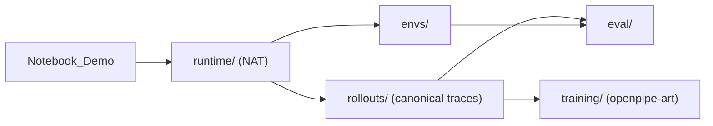

# Migration Plan

## Current Status
- **Phase 1** is **complete**.
- **Phase 2** is **complete**.
- **Phase 3** is **complete**.
- **Phase 4** is **complete**.
- **Phase 5** is **complete**.
- **Phase 6** is **complete**.
- **Phase 7** is **complete**.
- **Phase 8** is **complete**.

All migration phases are complete. The repo is fully refactored.

## Goal
Reshape the repository from a flat, notebook-led demo into a small library with clear ownership boundaries while preserving the current scenario, deterministic tools, and end-to-end workshop flow described in [CLAUDE.md](CLAUDE.md). The active target stack is NAT for runtime orchestration, repo-owned canonical rollouts and traces, and `openpipe-art` for training-oriented exports and post-training discussion.

## Current Pressure Points
- [src/agent_loop.py](src/agent_loop.py) currently mixes model I/O, prompt policy, validation, fallback repair, trace capture, and trajectory shaping.
- [src/evaluation.py](src/evaluation.py) and [src/training_export.py](src/training_export.py) both encode sequence and reward semantics, so training and offline evaluation are not clearly separated.
- [src/training_export.py](src/training_export.py) is the main catch-all module: it mixes historical rollout-style reward framing, earlier trainer-export assumptions, and scale-out-systems-oriented config sketches that no longer match the active environment.
- [notebooks/late_order_recovery_workshop.ipynb](notebooks/late_order_recovery_workshop.ipynb) is already a consumer of `src/`, but it still contains scripted demo traces and loop-like teaching code that should not remain the architecture source of truth.

## Target Architecture

## Ownership Guardrails
- `runtime/` owns single-episode agent behavior, prompt policy, tool invocation, directory-backed skill discovery, metadata search, detailed skill loading, skill-command execution, and structured event emission. It must not schedule rollout jobs, construct RL datasets, choose distributed training topology, or own checkpoint conversion logic.
- `envs/` owns task state, validity, transitions, terminal conditions, and reward-relevant facts. It defines what happened, but it must not decide rollout orchestration, trainer behavior, or distributed execution settings.
- `rollouts/` owns episode running, trace capture, failure and retry representation, and stable serialization for evaluation and training handoff. It must not redefine tool schemas, task environment logic, or reward semantics.
- `training/` owns `openpipe-art`-facing datasets, reward views, experiments, curriculum staging, and training-oriented exports. It must not redefine runtime interfaces or rollout orchestration.
- `eval/` owns offline metrics, reports, and regression summaries. It should consume canonical traces and environment facts rather than re-implementing task transitions.

## Implementation Phases
### 1. Establish canonical contracts first (complete)
- Create the new package skeleton under `src/`: [src/runtime](src/runtime), [src/envs](src/envs), [src/rollouts](src/rollouts), [src/training](src/training), [src/eval](src/eval), plus [src/main.py](src/main.py). If [src/systems](src/systems) remains in the tree, treat it as legacy or historical scaffolding rather than an active target package. The target package set should explicitly include [src/training/curriculum.py](src/training/curriculum.py) in addition to the other training modules.
- Introduce one canonical structured episode and event model early so every later move targets the same contract. Put the shared trajectory types in [src/rollouts/trace_types.py](src/rollouts/trace_types.py) and make them the source of truth for task input, initial environment state metadata, ordered turns, model actions, tool call payloads, tool results, validation and fallback events, step-level reward annotations, terminal outcomes, and summary metrics.
- Define the explicit canonical event vocabulary from the start: `user_task`, `model_thought` when intentionally preserved, `tool_call`, `tool_result`, `tool_validation_error`, `tool_repair_attempt`, `tool_reject`, `agent_message`, and `terminal_outcome`. Represent these as strongly typed dataclasses or Pydantic models so structured records replace unstructured trace text as the primary artifact.
- Split [src/schema.py](src/schema.py) into runtime-facing action schemas in [src/runtime/schemas.py](src/runtime/schemas.py) and task-specific validity rules in [src/envs/validators.py](src/envs/validators.py).
- Preserve [src/scenario_data.py](src/scenario_data.py) as the deterministic data source unless a tiny wrapper is needed for environment initialization; do not rewrite the synthetic data model unless required for formal environment state.

### 2. Refactor runtime into a NAT-friendly single-episode layer (complete)
- Move deterministic tool implementations from [src/tools.py](src/tools.py) into [src/runtime/tools.py](src/runtime/tools.py) and keep the registry and schema metadata there.
- Replace the flat skill module at [src/skills.py](src/skills.py) with a directory-backed runtime skills package under [src/runtime/skills](src/runtime/skills) so NAT uses explicit skill assets rather than a monolithic workflow file.
- Introduce the canonical runtime skill interfaces:
  - `list_skills` for discovery: skill name, description, tags, and discovered files.
  - `search_skills` for metadata search only: name, description, tags, declared assets, and filenames.
  - `get_skill` as the detailed read path, loading either the full `SKILL.md` body or a specific sidecar file by relative path.
  - `run_skill_command` for executing scripts present in the skills folder.
- Keep skill metadata, sidecars, and scripts colocated per skill directory so runtime discovery remains cheap while detailed reads stay explicit and traceable.
- Split [src/agent_loop.py](src/agent_loop.py) into small runtime modules:
  - [src/runtime/agent.py](src/runtime/agent.py) for the single-episode loop and model adapter boundary.
  - [src/runtime/prompts.py](src/runtime/prompts.py) for prompt and runtime policy.
  - [src/runtime/tracing.py](src/runtime/tracing.py) for emitting canonical structured events.
- Move fallback handling from [src/fallbacks.py](src/fallbacks.py) into explicit runtime parsing and repair behavior, but record repair and reject outcomes as structured events instead of silently normalizing them away.
- Keep [documents/llm-access.md](documents/llm-access.md) as the source of truth for the local model endpoint and model id.

### 3. Make the environment explicit (complete)
- Add [src/envs/state.py](src/envs/state.py), [src/envs/transitions.py](src/envs/transitions.py), [src/envs/rewards.py](src/envs/rewards.py), and [src/envs/late_order_env.py](src/envs/late_order_env.py).
- Encode the late-order-recovery state machine here: known facts, completed subgoals, allowed next actions, terminal conditions, invalid-action counters, and reward-relevant transition facts.
- Ensure environment state covers the core scenario facts: order id, source DC status, alternate DC feasibility, supplier expedite feasibility, partial-fulfillment feasibility, substitute SKU viability, tool calls already made, current recommendation candidate, failure flags, invalid-action counters, and terminal status.
- Move prerequisite and sequence-sensitive task semantics out of ad hoc checks in [src/tools.py](src/tools.py), [src/schema.py](src/schema.py), and [src/evaluation.py](src/evaluation.py) so the environment becomes the single authority on what happened and what was valid now.
- Keep deterministic tool execution unchanged in behavior; the environment should govern validity and state transitions, not replace the tool outputs.
- Implement dense, sequence-aware reward inputs here rather than only final success checks. At minimum, capture signals for valid structured tool calls, correct tool choice for current state, correct argument extraction, dependency satisfaction, non-redundancy, progress toward resolution, correct final recommendation, and concise completion.
- Include explicit penalties for malformed tool calls, invalid schema, dependency violations, repeated calls, looping behavior, hallucinated unsupported conclusions, overlong episodes, and silent fallback reliance. The decision process should be rewardable turn by turn.

### 4. Build the rollout layer around canonical traces (complete)
- Create [src/rollouts/episode_runner.py](src/rollouts/episode_runner.py), [src/rollouts/serializers.py](src/rollouts/serializers.py), and any training-export adapters needed for canonical trace handoff.
- Move episode capture and serialization responsibilities out of [src/agent_loop.py](src/agent_loop.py) and [src/training_export.py](src/training_export.py).
- Ensure rollout serialization preserves exact turn order, validation failures, repairs, rejects, and terminal outcomes so training and evaluation consumers can scale later without changing the episode schema.
- Keep rollout code independent from reward semantics and historical scale-out-systems assumptions.

### 5. Build training semantics layer (complete)
- Break up [src/training_export.py](src/training_export.py) rather than porting it whole.
- Move trainer-facing data views into [src/training/datasets.py](src/training/datasets.py) and [src/training/reward_views.py](src/training/reward_views.py).
- Replace the current earlier-trainer-stack adapter path with an `openpipe-art`-first adapter in [src/training](src/training), keeping any older trainer-specific files only as temporary compatibility shims or historical references until they are renamed or removed.
- Put stage definitions into [src/training/experiments.py](src/training/experiments.py) and curriculum staging into [src/training/curriculum.py](src/training/curriculum.py).
- Treat `openpipe-art` as the owner of reward views, datasets, and staged training progression.
- Design the training layer to support staged progression: SFT on successful trajectories, short-horizon RL with dense rewards, full multi-turn RL with sequence-aware rewards, and a robustness curriculum with malformed calls and dead ends.

### 6. Remove or quarantine outdated systems assumptions (complete)
- Decided to delete [src/systems](src/systems) — it contained only an empty legacy docstring, no active code depended on it.
- Removed `reference_scaleout_config_sketch()` and `save_training_config()` from [src/training_export.py](src/training_export.py).
- Removed corresponding notebook cell (11d) and scale-out references from notebook intro, section 11 framing, pipeline diagram (11e), and export cell.
- Removed `import src.systems` from [src/main.py](src/main.py) `_check_imports()`.
- Updated [README.md](README.md) to remove scale-out-systems-first language from active descriptions and migration status.
- No training path depends on scale-out-systems-specific launch, checkpoint, or parallelism configuration.

### 7. Rebuild offline evaluation on top of the new contracts (complete)
- Split [src/evaluation.py](src/evaluation.py) into [src/eval/metrics.py](src/eval/metrics.py) and [src/eval/reports.py](src/eval/reports.py). No regression module was needed at this stage.
- Evaluators now consume canonical `Episode` traces from [src/rollouts/trace_types.py](src/rollouts/trace_types.py) instead of backward-compatible `AgentTrace`.
- Scenario-specific constants (`EXPECTED_ARGUMENTS`, `OPTIMAL_TOOL_SEQUENCE`) sourced from [src/envs/rewards.py](src/envs/rewards.py) — the single authority — eliminating duplication that existed in the old evaluation module.
- Imports use canonical modules (`src.runtime.tools`, `src.runtime.workflows`, `src.envs.rewards`) directly, not backward-compatibility shims.
- [src/evaluation.py](src/evaluation.py) converted to a backward-compat shim with an `AgentTrace` → `Episode` adapter so existing notebook and training-export imports keep working during the transition.
- Kept offline reporting human-facing and post hoc; training-relevant reward semantics remain in [src/envs/rewards.py](src/envs/rewards.py) and [src/training/reward_views.py](src/training/reward_views.py).
- All seven workshop dimensions preserved: skill selection, tool validity, tool accuracy, sequence correctness, task success, recovery quality, efficiency.

### 8. Demote the notebook and finish the public surfaces (complete)
- Updated [notebooks/late_order_recovery_workshop.ipynb](notebooks/late_order_recovery_workshop.ipynb) to import exclusively from canonical modules (`src.runtime.*`, `src.envs.*`, `src.rollouts.*`, `src.training.*`, `src.eval.*`). No backward-compat shim imports remain in the notebook.
- Moved scripted trace builders out of the notebook into [src/rollouts/scripted_traces.py](src/rollouts/scripted_traces.py), producing canonical `Episode` objects enriched through the environment for rewards.
- Converted [src/training_export.py](src/training_export.py) from standalone implementation to a backward-compat shim that re-exports from canonical modules and provides `AgentTrace` adapters for legacy consumers.
- Cleaned up [src/main.py](src/main.py): removed legacy `--structured` flag and `AgentTrace`-based episode path; `--episode` now uses canonical `run_agent_episode()` directly. Expanded `_check_imports()` to cover all canonical and shim modules including `src.rollouts.scripted_traces`, `src.training.reward_views`, `src.training.datasets`, `src.training.experiments`, and `src.eval.reports`.
- Updated [README.md](README.md) with: package architecture diagram, ownership boundary table, module migration reference (what moved where), updated minimal Python example using canonical imports, CLI usage, historical context note clarifying `openpipe-art` ownership versus earlier trainer-facing and scale-out systems framing, and migration status showing all 8 phases complete.

## Order Of Execution
1. Introduce the new package tree and canonical trace and environment interfaces before moving behavior.
2. Move runtime code next so the agent can still run one episode against the new contracts, even if the notebook is temporarily out of sync.
3. Formalize environment state, validation, and reward inputs before splitting training and evaluation.
4. Split rollout serialization and dataset views only after the trace contract is stable.
5. Finish with notebook rewiring, docs, and verification after the runtime public surfaces are stable.

## Implementation Constraints
- Prefer small typed modules, focused functions, side-effect-light code, explicit public interfaces, and no hidden global state.
- Use dataclasses or Pydantic models for structured records rather than informal dict-only contracts.
- Do not hard-code notebook-only assumptions or bury config in ad hoc cells; keep launch surfaces config-driven.
- Keep deployment or system configuration separate from experiment and reward semantics, and do not let historical scale-out systems assumptions leak back into active code paths.
- Preserve the workshop scenario behavior, the current late-order-recovery flow, deterministic tool semantics, and the ability to run a local end-to-end demo.
- Prefer directory-backed skills with concise `SKILL.md` files plus optional sidecars and scripts over growing a single catch-all workflow module.
- Temporary notebook breakage during migration is acceptable; only the final state needs a working notebook consumer over the new library surfaces.
- Do not introduce unnecessary feature expansion or speculative abstractions without immediate use.
- Do not rewrite [src/scenario_data.py](src/scenario_data.py) unless environment formalization requires it.
- Do not remove the notebook; demote it to a consumer.

## Deliverables
- Required code deliverables: new package structure under `src/`, canonical trajectory and event types, explicit environment state transitions, a runtime skills package with `list_skills`, `search_skills`, `get_skill`, and `run_skill_command`, split runtime vs rollout vs training vs evaluation layers, updated imports and entrypoints, updated notebook wiring, and an `openpipe-art`-first training export path.
- Required documentation deliverables: updated [README.md](README.md), module docstrings explaining responsibilities, migration notes summarizing what moved where, and a brief note clarifying active `openpipe-art` responsibilities versus historical trainer-facing, rollout-shaping, and scale-out systems context.
- Optional but encouraged deliverables: a small CLI entrypoint for running one episode, a simple example of serialized trajectory output, a short architecture diagram in markdown, and one example environment-specific or legacy-systems config profile if that scaffolding is retained.

## Acceptance Criteria
- Clear ownership boundaries exist across runtime, environment, rollouts, evaluation, and training semantics.
- No catch-all replacement for [src/training_export.py](src/training_export.py) reappears; export, training, rollout, and systems concerns are split cleanly.
- Structured typed event records are canonical across runtime, rollouts, training, and evaluation.
- NAT-facing runtime behavior uses a directory-backed skills architecture with `list_skills`, `search_skills`, `get_skill`, and `run_skill_command` as the canonical discovery, read, and execution surfaces.
- Environment transition rules and task semantics are explicit and are not hidden in notebook cells or evaluation helpers.
- The notebook is demoted to a consumer of the library rather than a holder of core logic.
- `openpipe-art`-facing training semantics are clearly separated from runtime, rollouts, and evaluation.
- Multi-turn RL readiness improves through support for successful and failed trajectory collection, dense reward shaping, rollout batching, and trainer ingestion.
- No active path depends on earlier rollout-stack or scale-out-systems-specific integrations; any remaining references are clearly historical.
- One local episode still runs end-to-end for `SO-10482`, preserving the existing workshop scenario.

## Main Risk To Watch
The biggest implementation risk is moving too much behavior at once and breaking the demo. The safest approach is to land the shared contracts first, then migrate one concern at a time without preserving notebook compatibility mid-stream, and only rewire the notebook and entrypoints once the runtime surfaces are stable.
